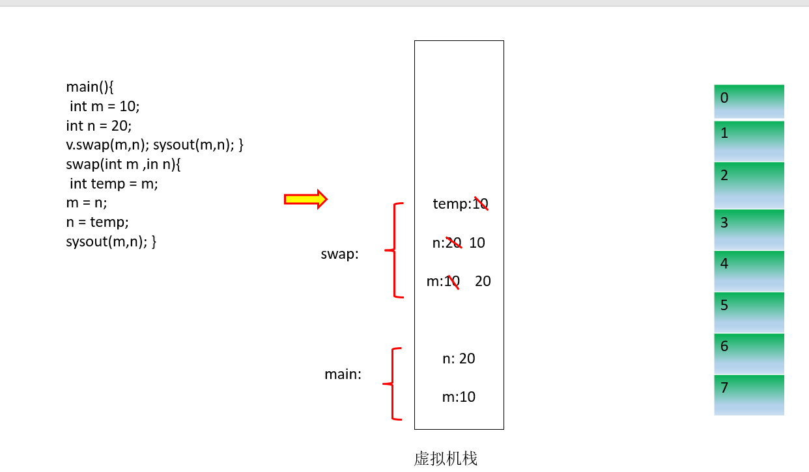
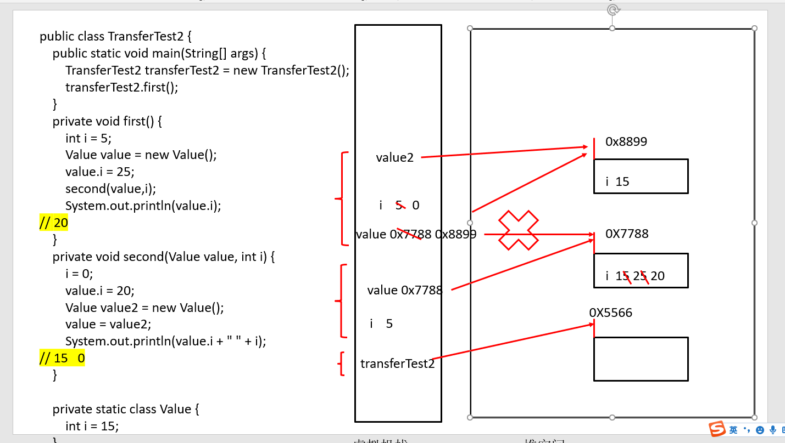

# day08 面向对象
## 一.面向对象与面向过程
面向对象与面向过程一样都是一种设计思想, 只不过考虑的方式不一样

 面向过程:

    强调的是功能行为, 以函数为单位,强调是怎么做
 面向对象:

    强调的是具备了功能的对象,以类/对象为最小单位,强调的是谁来做.

## 二.面向对象的三大特征.
封装

继承

多态.
## 三.某一场景下面向过程与面向对象的不同思考
把大象装进冰箱需要多少步骤?

面向过程:
1. 打开冰箱大门
2. 把大象装进冰箱
3. 关闭冰箱大门

面向对象:
有三个主体,考虑创建三个类

人{

打开(冰箱) {}

操作(大象) {}

关闭(冰箱) {}

}

冰箱{

开门() {}

关门() {}
}

大象{
    进入() {}
}

## 面向对象的两个要素 类与对象
类: 是抽象的概念, 描述的是某一类事物

对象: 是具体的概念, 描述的是某一类事物下某一个具体的个体

面对对象的程序设计重点就是设计类

设计类就是设计类的成员变量和成员方法
 
## 类的组成
1. 属性 成员变量
2. 方法 成员方法
3. 构造器
4. 代码块
5. 内部类

## 理解万事万物皆是对象

1. 在java语言范畴内,我们都将属性,功能封装到一个类中.通过类的实例化.来调用具体的功能和属性
2. 在非java语言范畴内, 比如在与前端的html中的标签,后端的数据库进行交互的时候,都体现为使用对象进行交互.

## 引用数据类型的变量

如果一个变量是引用数据类型的, 则它存储的不是具体的数据.而是存储的堆内存中具体数据的首地址值,或者存的是null;

## 参数的值传递

