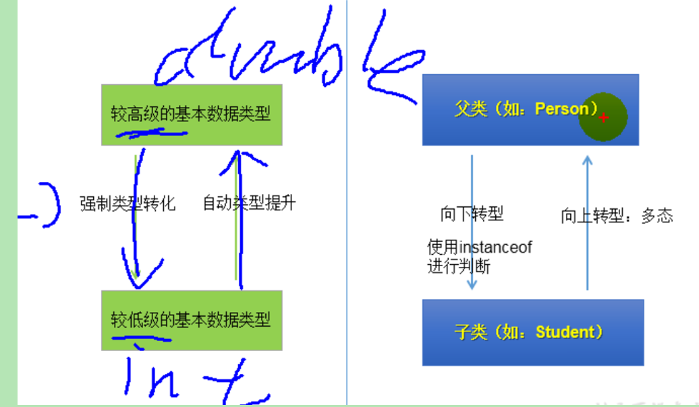

# day11 面向对象
## 继承
### 一.继承的好处:
* 1.减少了代码的冗余,提高了代码的复用性
* 2.便于功能的拓展
* 3.为之后的多态,提供了前提
### 二.继承的格式
 class A extends B{ }
 A: 子类,派生类, subclass
 B: 父类, 基类, superClass

2.1 体现: 一旦子类继承了父类,就获取了父类中所有声明的属性和方法
  特别的: 父类中声明为private的属性和方法,因为封装性的原因,不能直接调用父类的这些结构,
         但是依然认为获取了父类的结构和方法(可以间接调用)
2.2 子类继承了父类之后,可以声明自己特有的方法,实现功能的拓展 extend即为拓展的意思

### java中关于继承的规定

1.一个类可以被多个子类所继承
2. 一个类只能有一个父类(单继承),但是可以通过间接继承获取更多的属性和方法

### 方法的重写
1.概念: 子类继承父类之后,可以对父类中同名同参数列表的方法,进行覆盖操作

2.重写规定  
    方法声明:  权限修饰符 返回值类型 方法名(参数列表) {
                    方法体             
               }
 a.子类重写的方法的权限修饰符 要>=父类的 特别的子类不能重写父类中的私有方法
 b.子类返回值类型
  父类返回值类型是void的,则子类的返回值类型也应该是void
  父类的返回值类型是基本数据类型,则子类的返回值类型也应该是对应的基本数据类型
  父类的返回值类型是引用数据类型. 则类返回值类型,要<=父类的
 c. 子类的抛出的异常要<= 父类的.

### super关键字

1.我们可以在子类的构造类或者方法中, 通过super.属性, 或者super.方法的形式来 来调用父类中声明的公有的属性/方法
一般可以省略, 特别的,如果子类中存在和父类同名的属性和方法时,则需要显式的添加super.属性, super.方法的形式
来调用父类中的内容.
2.super调用构造器
 2.1 我们可以在子类的构建器中,通过super(参数列表) 来调用父类的构造器
 2.2 super(参数列表) 必须声明在子类构造器的首行.
 2.3 在类的构造器的首行,不是调用父类的super(参数列表) 就是调用自己的this(参数列表) 只能二选一
 2.4 如果没有显示的声明,则默认是调用父类的super()

### 子类实例化的过程

1.从结果上看  子类继承了父类 ,就获取了父类中声明的属性和方法. 
             创建子类的实例,就会在堆空间中加载父类中声明的属性
2.从过程上看  
   当我们通过子类的构造类去实例化一个子类的对象的时候,会直接或者间接的调用父类的构造器,直到调用到了java.lang.Object类中
 无参构造器为止.来加载父类中的属性和方法.这样我们才能使用父类中的结构.

## 多态
### 多态定义
定义: 多态,即一个事物的多种形态

### 多态本质
本质: 即父类的引用指向子类的对象

### 多态使用
 即虚拟方法调用
我们在编译期, 只能调用父类中声明的方法(虚拟方法), 
但是在运行期, 我们实际运行的是子类重写父类的方法.
编译看左边,运行看右边

注意:对象的多态,只适用于方法,不适用于属性,属性是编译和运行都看左边.

### 多态使用的前提
1.类的继承关系
2.方法的重写.

### 向上转型(多态) 向下转型
有了对象的多态之后,虽然运行时内存中加载的是子类的属性和方法, 但是由于左边声明的对象的引用是父类类型.
所以只能调用父类中的属性和方法.
如果想调用子类中特有的方法,此时就需要向下转型(向下转型之前需要的使用instanceof 判断 左边的实例是否是右边类的对象)

