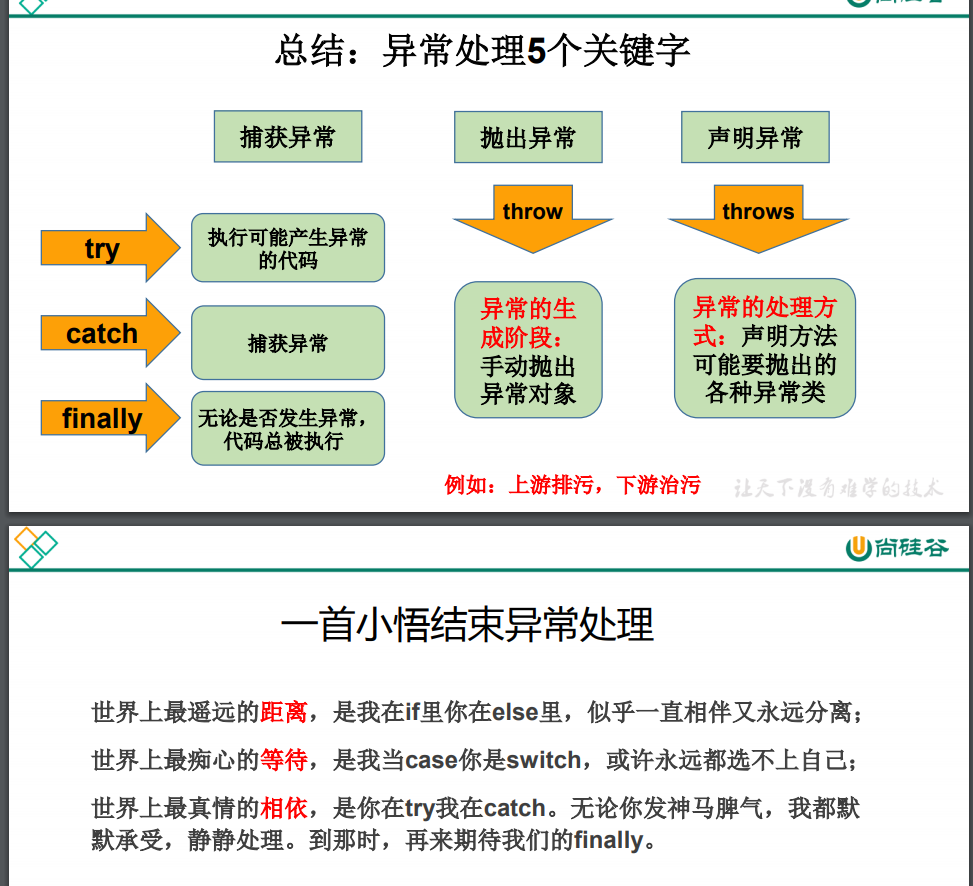

# 异常目录

# java程序异常的分类

## Error
java虚拟机无法解决的严重问题, 例如JVM内部错误,资源耗尽等问题
StackOverFlow ,Out of Memory
这类问题,一般不编写针对性的代码进行处理
## Execption
### 编译时异常
即在java源文件    ->(javac.exe)  编译成字节码.class文件时出现的异常. 这个时候如果有异常.则不会生成对应的字节码文件
IOException(FileNotFoundException)
ClassNotFoundException
CloneNotSupportException

### 运行时异常(RuntimeException)
即字节码文件(.class文件)    ->(java.exe)  在jvm虚拟机中执行时, 报的异常
NullPointerException  IndexOutOfBoundException ArithmeticException
IllegalArgumentException, ,ClassCastException ,  NoSuchElementException

#
