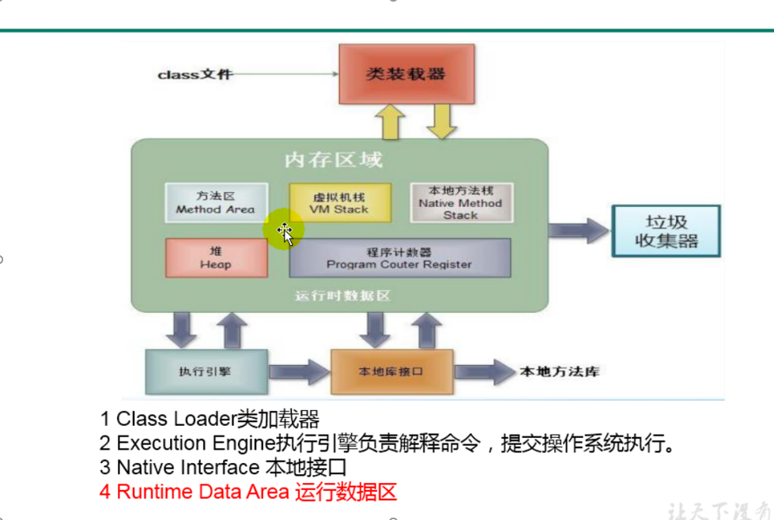
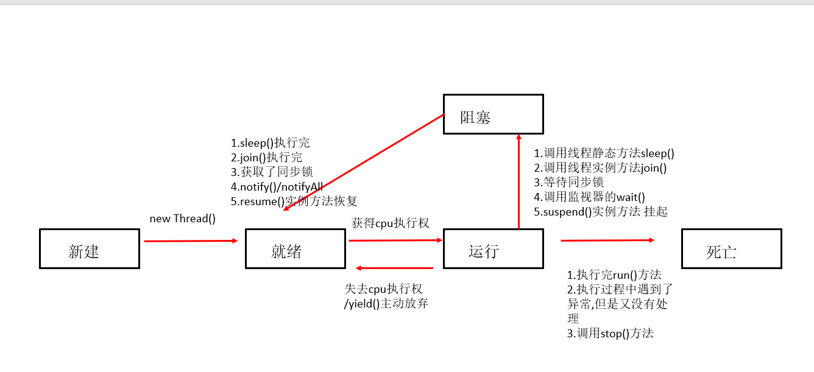

#基本概念
## 程序 进程 线程
程序: 完成某一个特定任务.用编程语言编写一组指令的集合.说白了就是一段静态的代码
进程: 正在运行的一个程序,即静态代码执行了起来就是一个进程.
     资源分配的最小单位.
线程: 进程可以细分为线程, 线程就是进程内部的某一条执行路径. 
     如果一个进程同一时间内并行的执行多个线程,那么这个进程就是多线程的.
    调度执行的最小单位. 每个线程都独立的拥有一个程序计数器和一个虚拟机栈.方法区和堆内存是共享的

##      
一个java应用程序, 例如:java.exe  最少对应着三个线程, main 主线程, gc垃圾回收线程, 异常处理线程
并行: 多个CPU执行多个任务. 比如:多个人同时做不同的事情
并发: 一个CPU(时间片)执行多个任务. 比如: 秒杀

## 多线程程序的优点
如果CPU是单核的,那么开启多线程的话. 
缺点: 涉及到线程来回切换. 效率较低
优点: 提高应用程序的响应(尤其是图形化的界面)
     提高CPU新的利用率
     改善程序结构.将即长又复杂的一个进程分为多个线程

## java中线程的分类
两类:一类是守护线程,一类是用户线程
守护线程是为用户线程服务的,所以守护线程不能单独存在
如果JVM中都是守护线程,则当前JVM会推出.

## 线程的生命周期

## 线程的同步
(协同步调,当一个线程操作共享数据的时候,其他线程不要操作.)
. 多线程出现了安全问题
2. 问题的原因：
   当多条语句在操作同一个线程共享数据时，一个线程对多条语句只执行了一部分，还没有
   执行完，另一个线程参与进来执行。导致共享数据的错误。
3. 解决办法：
   对多条操作共享数据的语句，只能让一个线程都执行完，在执行过程中，其他线程不可以
   参与执行。

1. 同步代码块：
   synchronized (对象){
   // 需要被同步的代码；
   }
2. synchronized还可以放在方法声明中，表示整个方法为同步方法。
   例如：
   public synchronized void show (String name){
   ….
