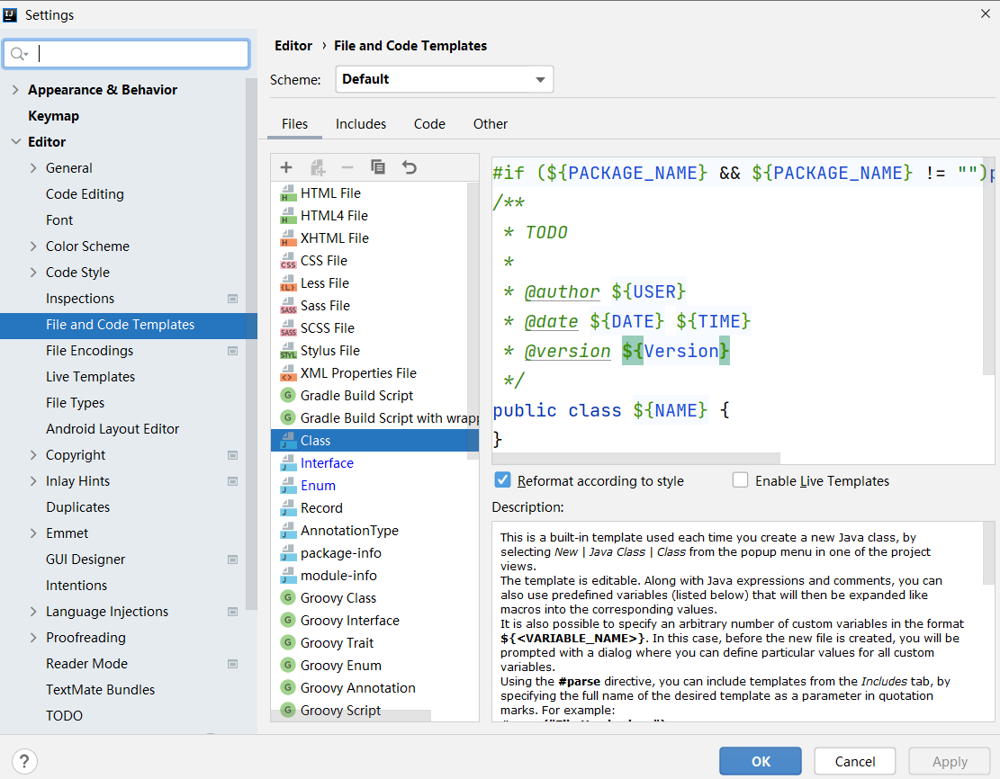
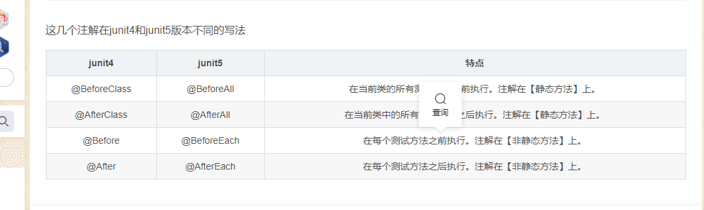

# 注解
## 一.背景
1.JDK5.0开始,增加了对注解(元数据)的支持
2.Annotation就是代码里面的特殊标记, 这些标记可以类编译,class加载,以及执行过程被读取.并且执行相应的逻辑处理
目的可以代替之前的JAVAEE中繁杂代码和xml配置.
3.Annotation可以像修饰符一样的修饰, 修饰 类, 构造器, 属性,方法,局部变量
4.注解是未来开发模式的一种趋势,像现在流行的Spring2.5以上都是基于注解.
框架: 注解 +反射 +设计模式.
5.常见的注解的示例
①文档注释中包含的相关注解 
@author
@since

②在编译进行检查的注解(JDK内置的三个注解)
@Override : 修饰方法.限定该方法为重写父类/接口中的方法  
@Deprecated:修饰类.方法. 表该类/方法已经过时了
@SuppressWarnings: 抑制编译器告警.

③跟踪代码依赖性,实现替代配置文件的功能

6.junit4和junit5单元测试.
