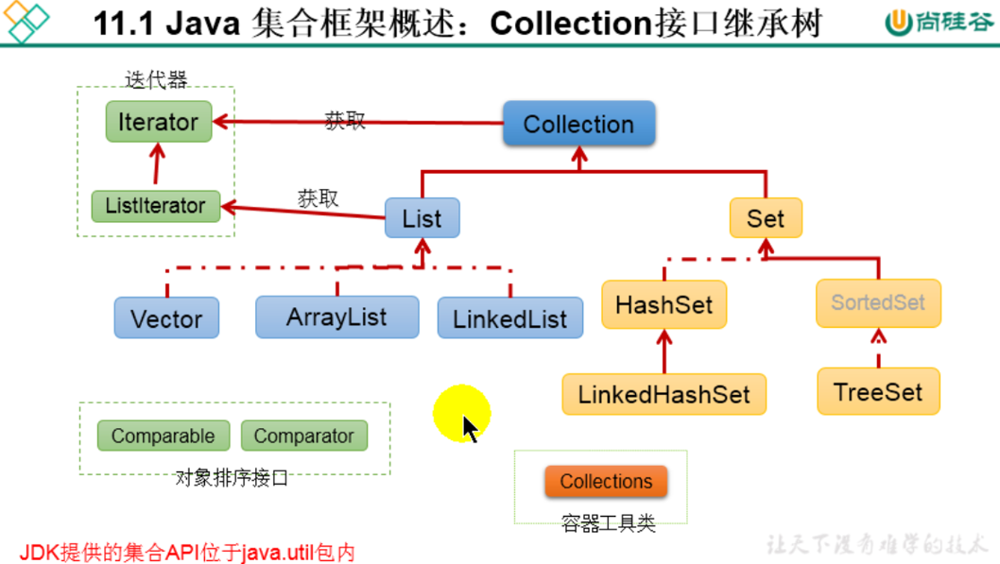
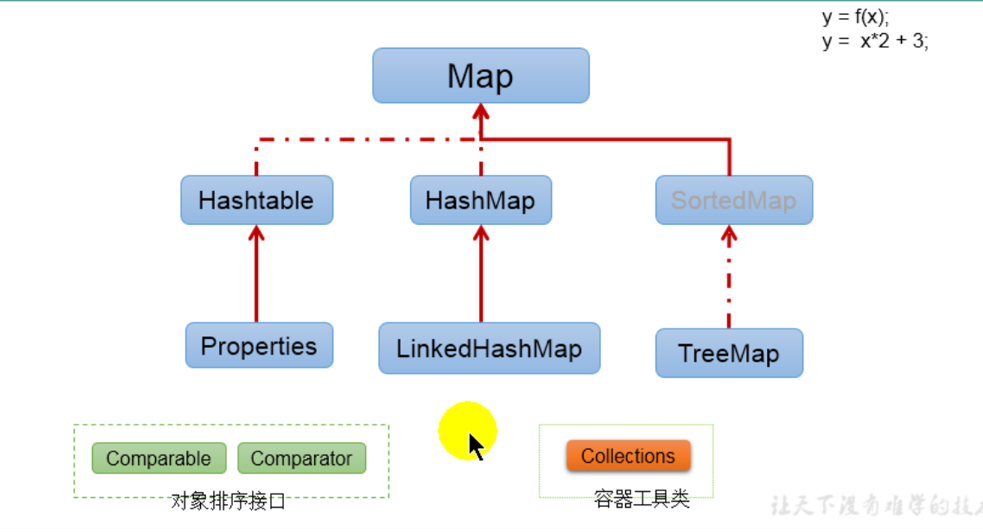
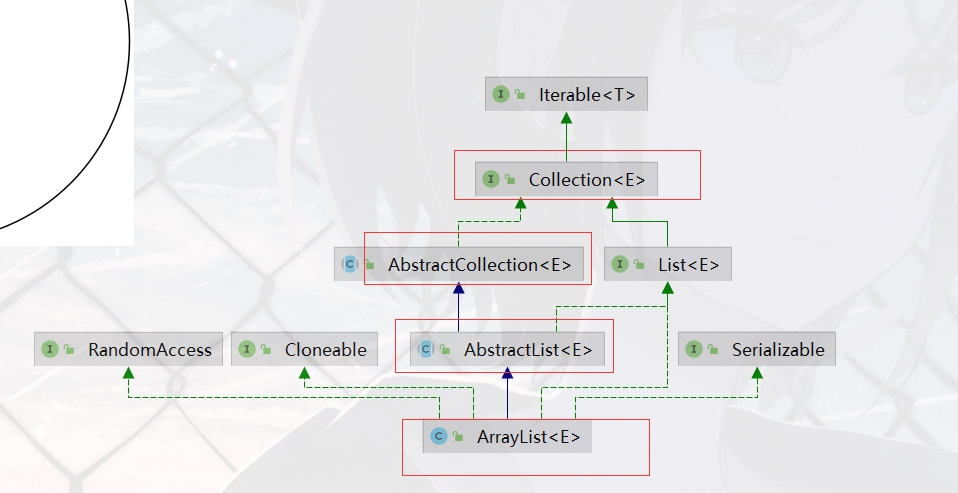
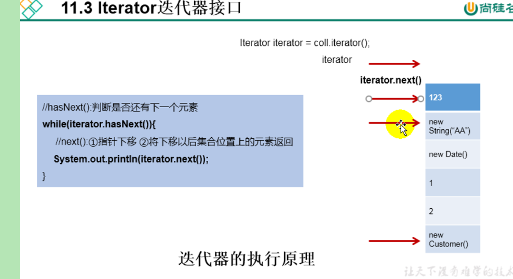
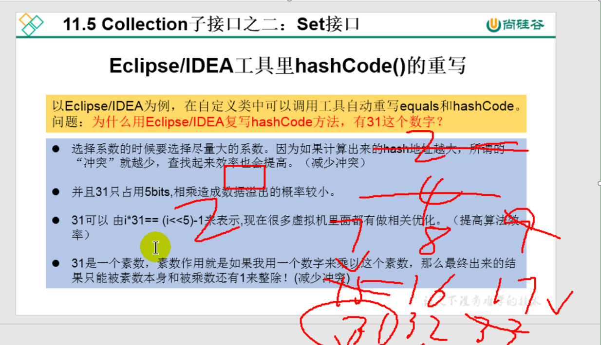
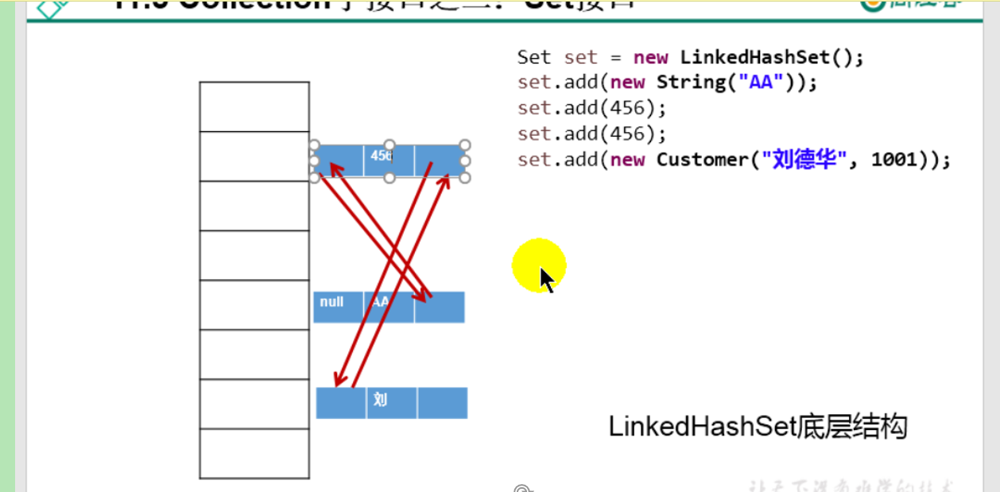
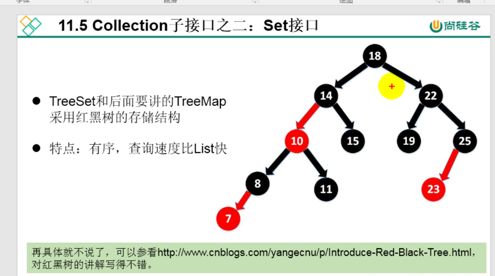

# 容器概述
## 一.集合框架出现的背景
1.集合,数组都是用来存储多个数据的结构, 简称容器
  此时的存储,指的是内存层面的存储,不涉及到持久化操作(.txt. .jpg,.avi, 数据库)
2.1数组在存储多个数据的特点
    ①一旦初始化后,其长度就确定了
    ②一但声明后,其存储的数据类型也就确定了,比如 String[] arr1; int[] arr2; Object[] arr3
2.2数组在存储多个数据的缺点
    ①一旦初始化后,其长度就不可改变
    ②数组提供的方法非常有限.对于添加,删除,插入数据非常不便,同时效率不高.
    ③获取数组中实际元素的个数.数组没有提供对应的属性和方法
    ④数组的存储特点: 有序,可重复, 对于无序,不可重复的需求,无法满足

## 二.集合框架
1.Collection接口体系(存储单列数据)

2.Map接口体系(存储双列数据)

|----Collection接口:单列集合,用来存储一个一个的对象
    |----List接口 存储有序的,可以重复的数据 -->"动态数组"
        |---- ArrayList, LinkedList,Vector
    |----Set接口,存储无序的,不可重复的数据 --> 高中数学的"集合"
        |---- HashSet, LinkedHashSet,TreeSet
|----Map接口: 双列集合,用来存储一对数据(key-value) 高中数学的y=f(x)
    |----HashMap LinkedHashMap
    |----HashTable, Properties
    |---- TreeMap
3.Collection中重写toString()方法的位置.

4.迭代器执行的原因

5.idea重写hashcode 方法,为什么会有31这个数字?

6.LinkedHashSet原理

7.TreeSet原理
