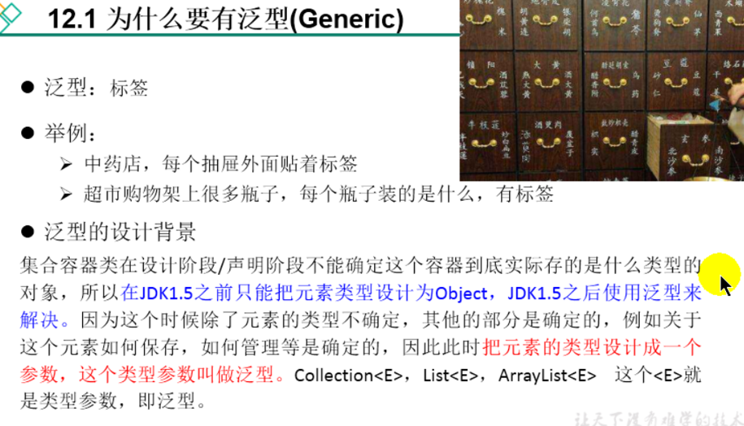

# 一.为什么要有泛型

JDK1.5之前,集合容器在声明的时候,无法确定里面到底要装什么类型的元素. 所以元素一律声明为Object类型.但是这种类型太笼统了.后续操作元素的时候
又涉及到向下转型,还有可能出现类型转化异常的问题
JDK1.5为了解决这个问题.引入了泛型. 即在容器上贴了一个类型标签.表示这个容器只能装这种类型的数据.其他类型不能装.
所以泛型就是一个类型参数. 比如: Collection<E> List<E>, ArrayList<E> 这个<E> 就是泛型.
# 二.在集合中使用泛型
# 三.自定义泛型结构
# 四.泛型在继承中的体现
# 五.通配符的使用
# 六. 泛型的应用举例