# 流的分类
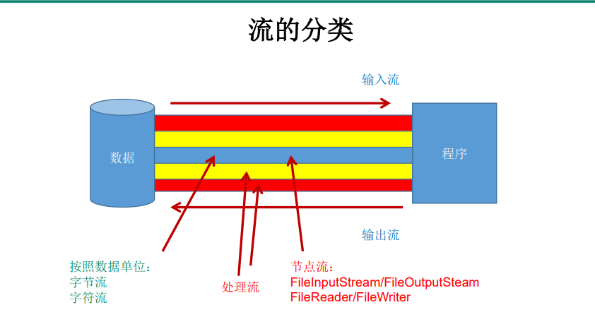
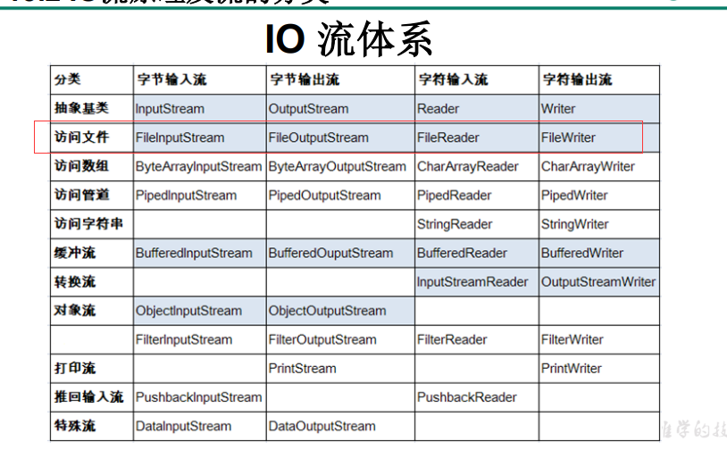

# 流的基类的API
## InputStream & Reader
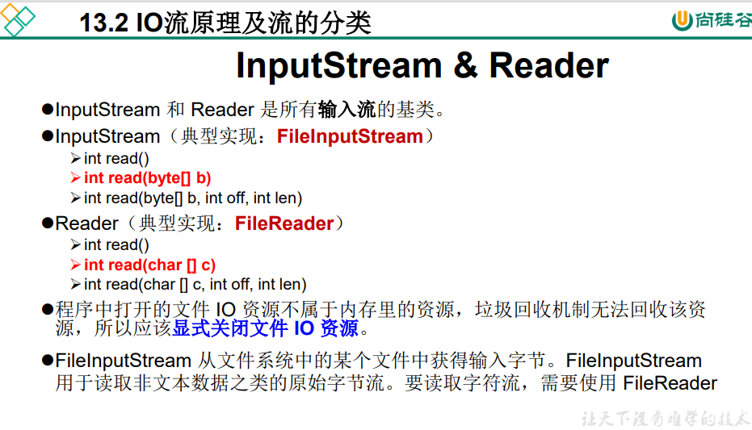
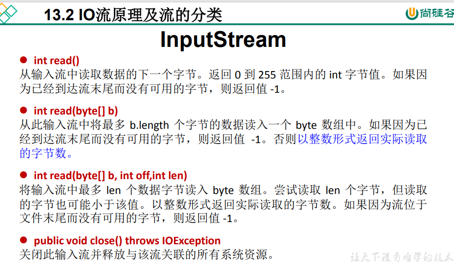
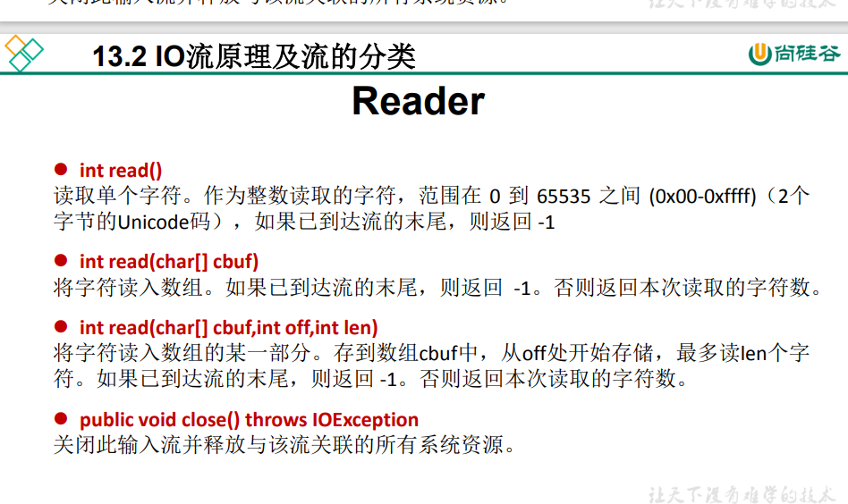

## OutputStream & Writer
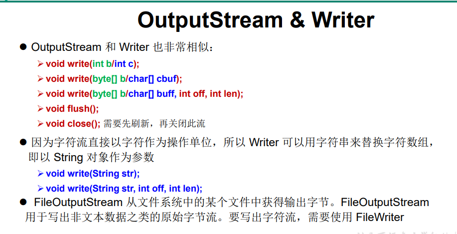
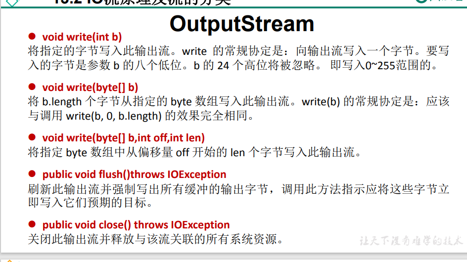
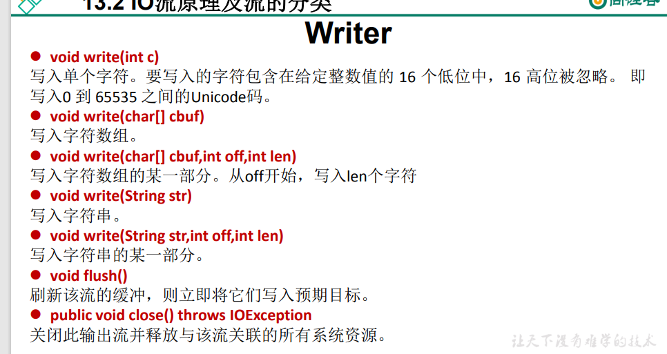

## 转化流
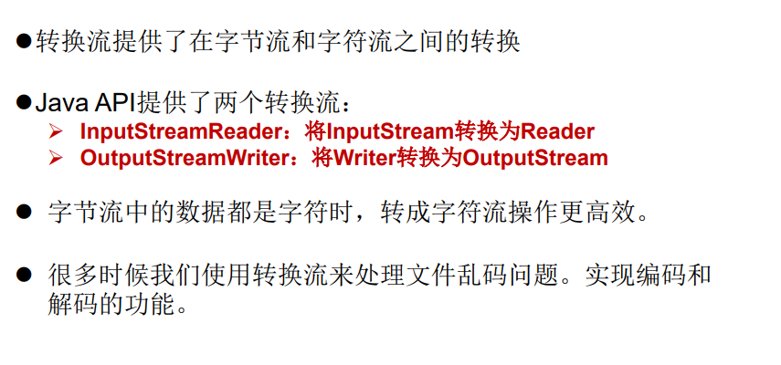

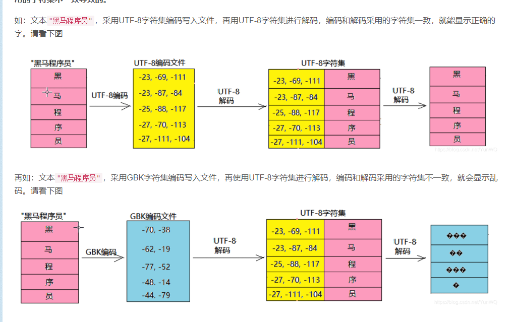

# 对象流 以及网络编程
网络编程的目的: 直接或者间接的通过网络协议与其他计算机进行通信.
网络编程中的两个问题:
1.如何准确的定位到网络中的某一台主机,定位到某一台主机的某一个应用.
2.找到主机之后如何安全可靠的进行网络传输.
问题一方案: 确定通信双方的地址: IP地址 + 端口号
问题二方案: 按照一定的规则进行数据的传输.
(OSI参考模型:模型过于理想化,不能再因特网上进行推广使用)
TCP/IP参考模型: (TCP/IP协议)事实上的国际标准.
OSI参考模型:         TCP/IP参考模型:                    TCP/IP各层参考模型对应的协议
应用层                     应用层                             HTTP(超文本传输)/FTP(文件传输)/Telnet(远程连接)/DNS(域名解析)
表示层
会话层                     
传输层                     传输层                             TCP/UDP
网络层                     网络层                             IP/ICMP/ARP                  
数据链路层
物理层                 物理层+ 数据链路层                      Link

数据传输的过程:
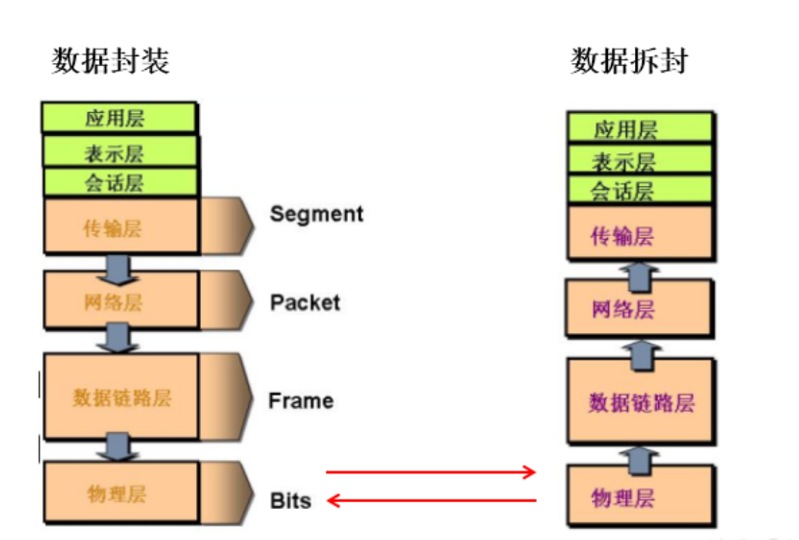

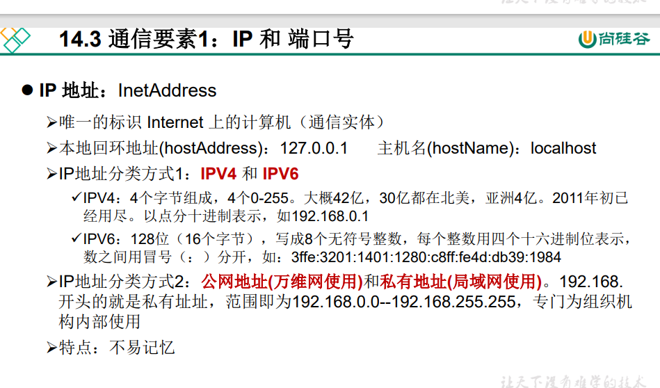
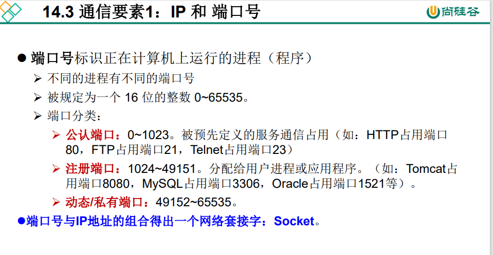
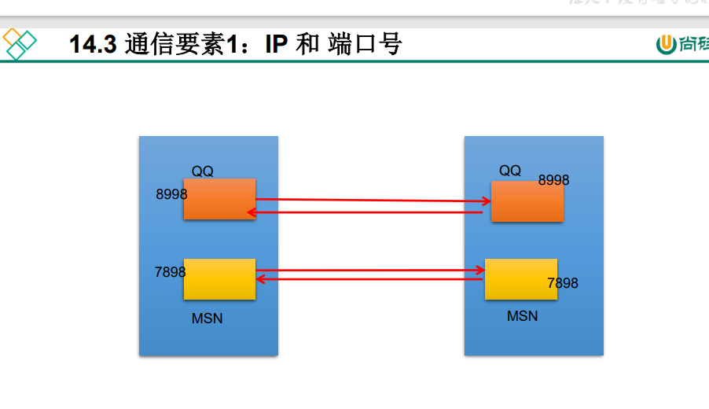

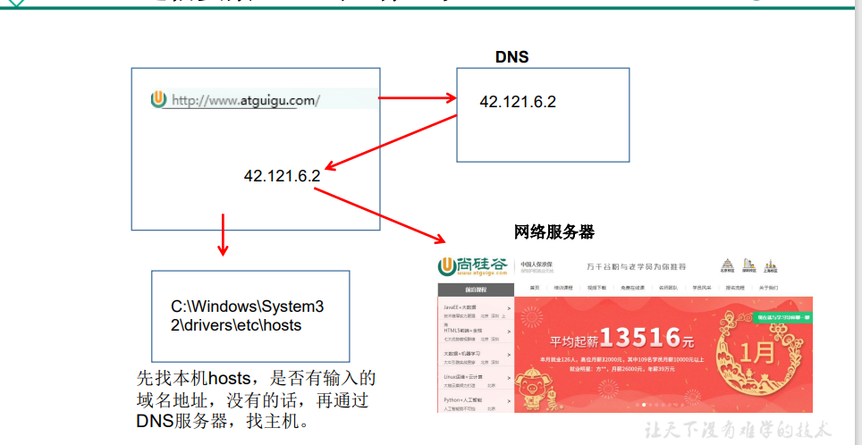
# 三次握手,四次挥手
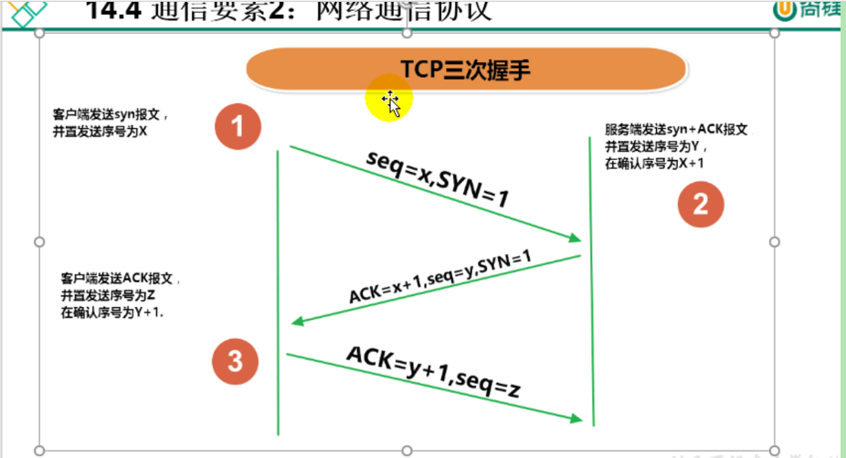
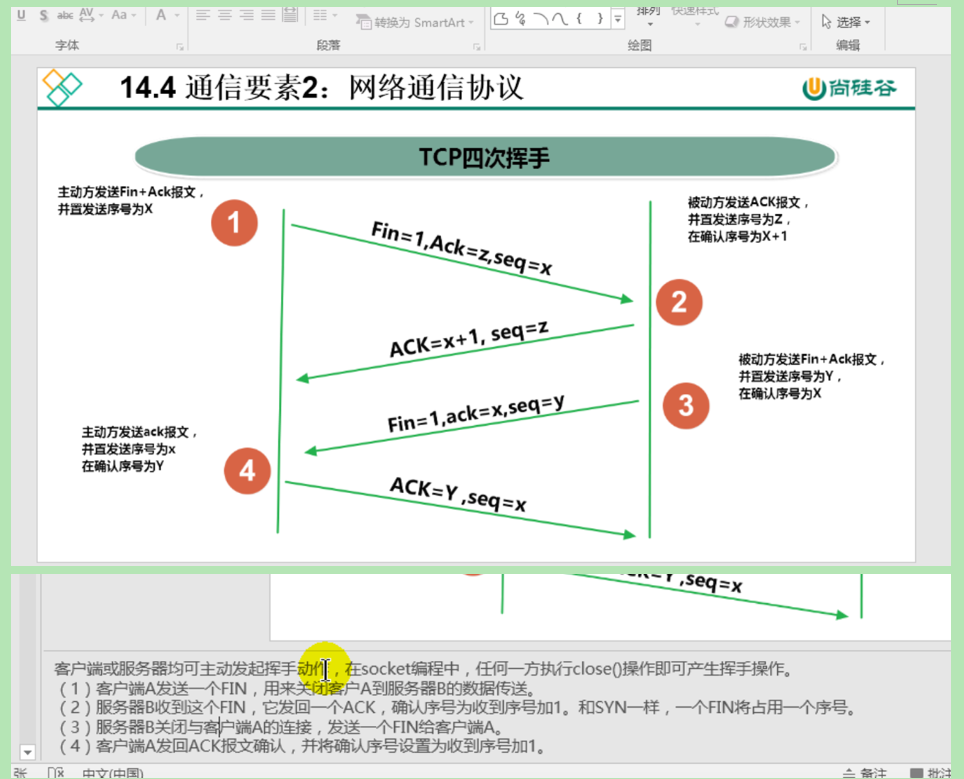
