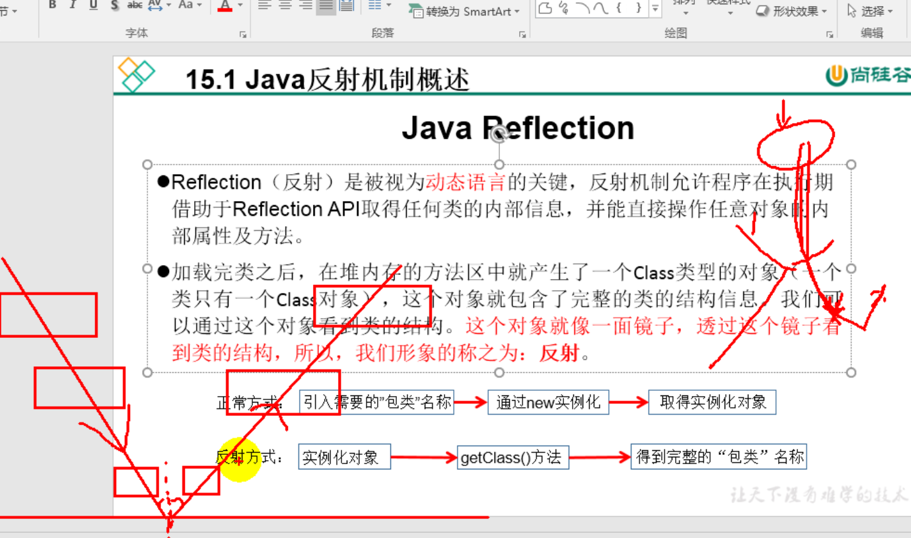
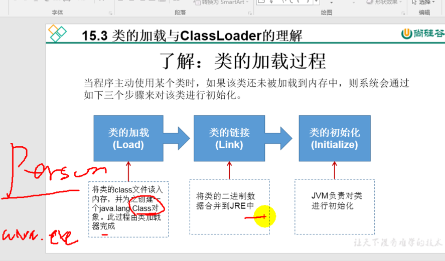
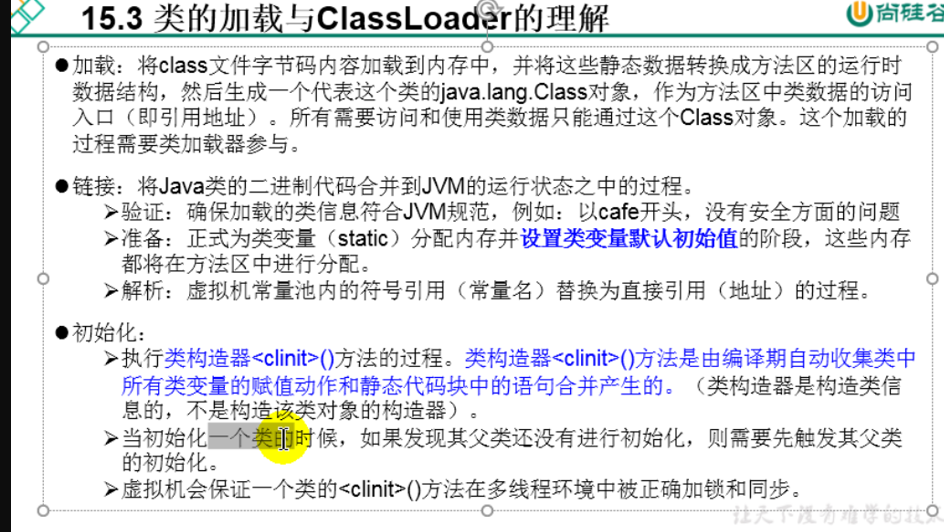
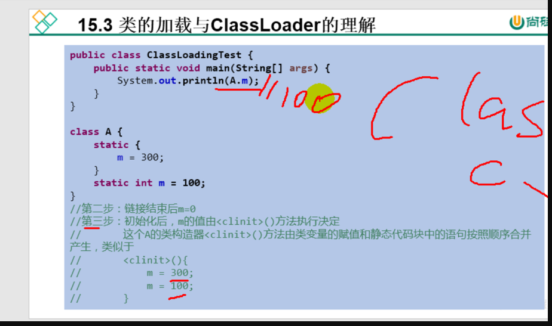
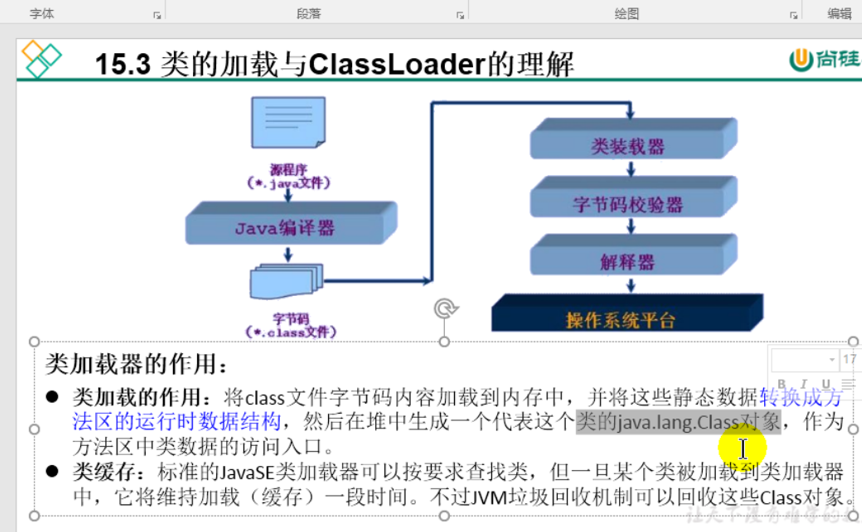
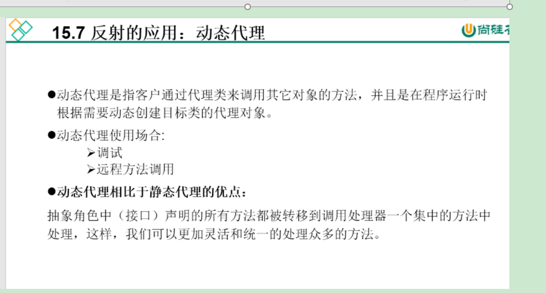
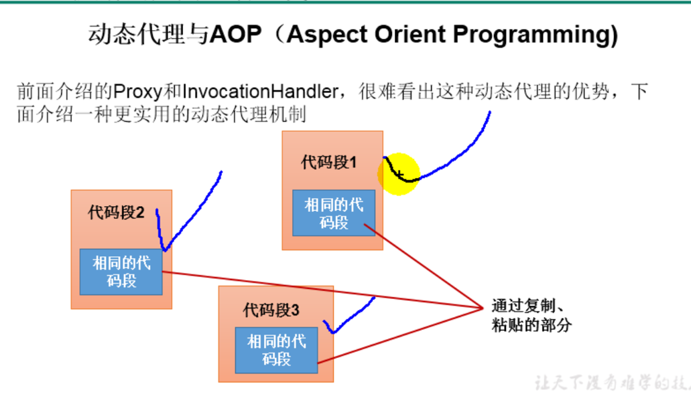
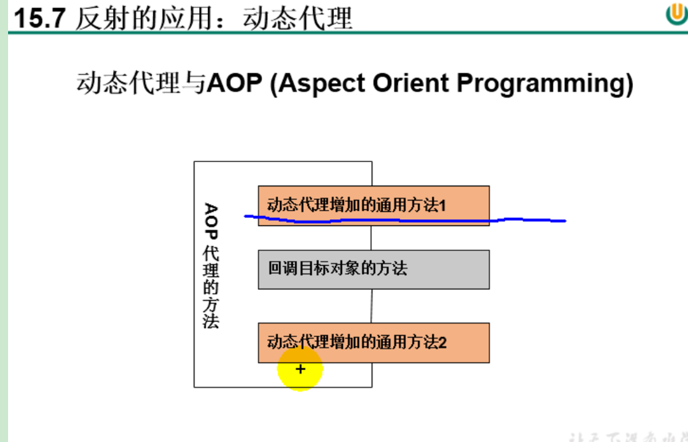

# 反射

#类的加载过程

# 类加载器的作用

## 类加载器的分类
引导类加载器:用C++编写.用来加载java的核心类库,该加载器无法无法直接获取  Bootstap ClassLoader
扩展类加载器:用来加载jre/lib/ext/xxx.jar的jar包.该加载器可以直接获取  Extension ClassLoader
系统类加载器:用来加载output path所指定的class文件.(即自定义类) System ClassLoader

# 反射的应用:(动态代理)

# AOP

